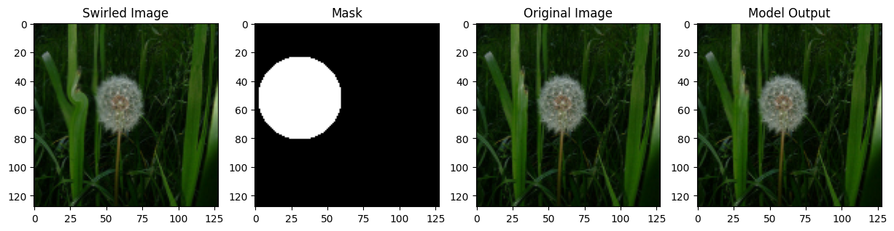
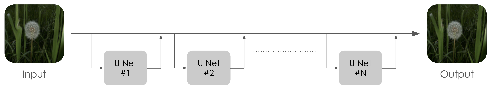
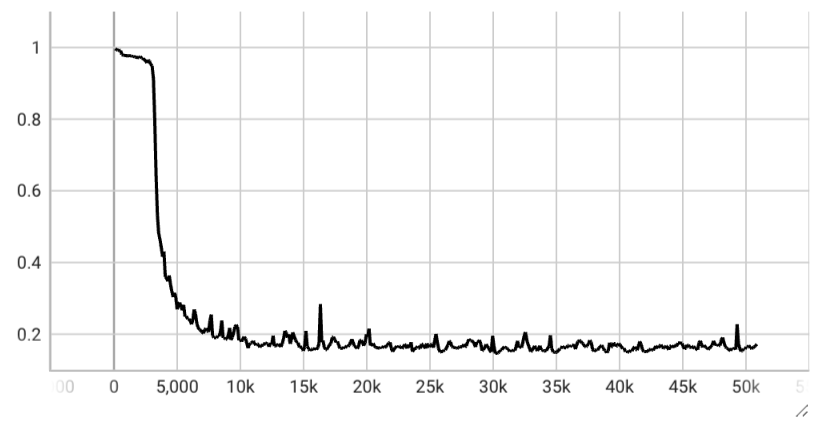

# Swirl Correction Network

This repository contains a neural network implementation to tackle a toy problem: correcting the swirl effect artificially introduced in images of the [TensorFlow Flowers dataset](https://www.tensorflow.org/datasets/catalog/tf_flowers). 


<p align="center">
    
</p>


The swirl effect is a distortion that can be introduced in a image using the [`swirl`](https://scikit-image.org/docs/0.25.x/auto_examples/transform/plot_swirl.html) method from the `scikit-image` library. The goal of this project is to train a neural network to learn how to reverse this effect, restoring the original images.

## Neural Network
This section describes the proposed neural network designed to correct the swirl effect.

**Architecture.** $~$ The network proposed here is a residual network that gives the output $\hat{y}(x) = x + r_1(x) + \ldots + r_N(x)$, 
where $r_i(x)$ are the residual blocks of the network implemented as U-Nets and $x$ is the swirled input image. 

<p align="center">
    
</p>

**Loss Function.** $~$
The loss function used to train the network is a patch-based loss, that restricts the computation of the loss to the top-K patches showing the largest Mean Squared Error with respect to the ground truth. This is done to focus the training on the most problematic areas of the image, which are typically the ones with the most distortion. The patch size is set to 16x16, for a total of 64 patches per image. The loss is computed as follows:

$$
\mathcal{L}(x,y) = \frac{1}{K} \sum_{i=1}^{K} \| P_i(\hat{y}(x)) - P_i(y) \|^2
$$

where $x$ is the swirled image, $y$ is the ground truth image, $P_i$ denotes the $i$-th patch, and $K$ is the total number of patches considered in the loss computation.

**Dataset.** $~$
The images in the [TensorFlow Flowers dataset](https://www.tensorflow.org/datasets/catalog/tf_flowers) have different sizes, so we resize them to a fixed size of 128x128 pixels and normalize the pixel values to the range [0, 1]. 

**Training.** $~$
The training strategy consists in reducing the number of patches considered in the loss function as the training progresses. The initial number of patches ($K$) is set to 64, and it is reduced to 16 after 5 epochs, to 8 after 80 epochs, and to 4 after 150 epochs. 

By starting with $K=64$ (entire image), the networks learns to reconstruct the swirled image as a whole. Five epochs are enough to achieve good reconstructions thanks to the residual architecture. After that, the number of patches is reduced so that the networks learns to transform the most distorted areas of the image, by inverting the swirl effect.

**Evaluation metric.** $~$
The evaluation metric used to assess the performance of the network is the following:

$$
E(\hat{y}(x),y) = \frac{MSE(\hat{y}(x),y)}{MSE(x,y)} 
$$

where $MSE$ denotes the Mean Squared Error, $x$ is the swirled image, $y$ is the ground truth image, and $\hat{y}(x)$ is the output of the network. The metric ranges from 0 to 1, where 1 means that the network is able to reconstruct the swirled image perfectly, and 0 means that the network is able to invert the swirl applied to the ground truth image.

The network achieves an evaluation score around `0.16` on the test set containing images never seen during training.

<p align="center">
    
</p>

## Usage

```bash
python -m src.models.unet.train -c=src/models/unet/config.yaml
```
